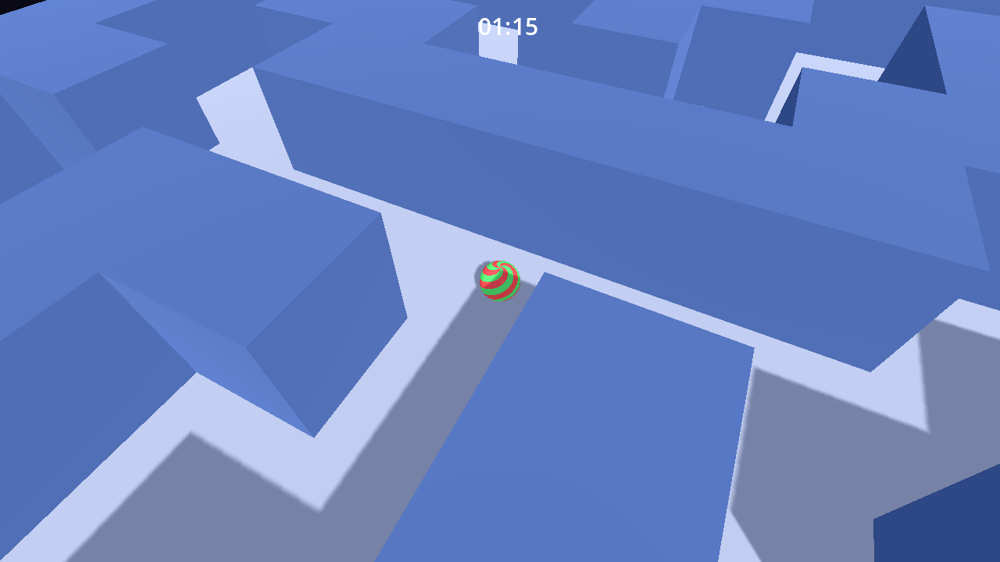
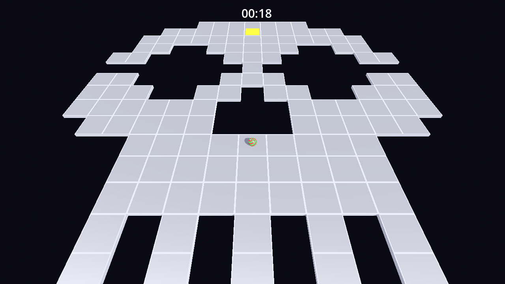
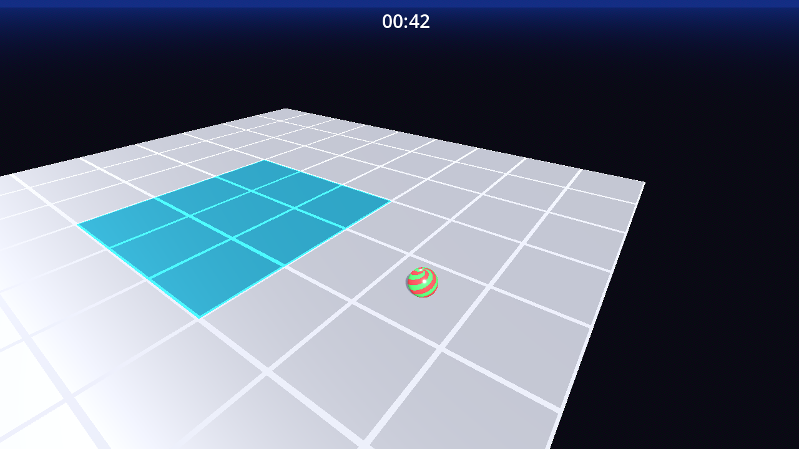
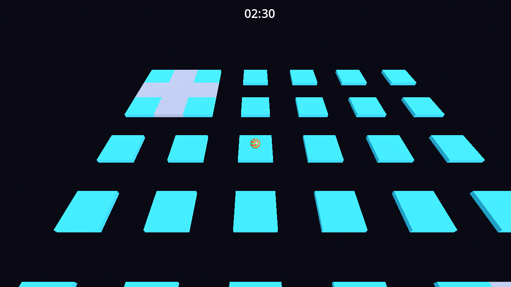
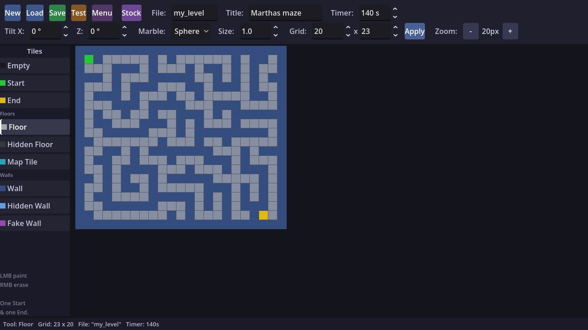

# Marble Maze

A 3D marble maze game inspired by the 'Marble It Up!' series. Guide your marble from the Start tile to the Goal tile before the timer runs out. Unlock all built-in levels. Create your own levels with the level editor. Find short cuts and cheat modes for speed runs.

## Screenshots

<table>
  <tr>
    <td></td>
    <td></td>
  </tr>
  <tr>
    <td></td>
    <td></td>
  </tr>
  <tr>
    <td colspan="2"></td>
  </tr>
</table>

## Play it in your browser

- [GitHub Pages](https://frank-laemmer.github.io/marble-maze/)
- [itch.io](https://franktheprank.itch.io/marble-maze)

## Download

| Platform | Link                                                                                                                                            |
| :------- | :---------------------------------------------------------------------------------------------------------------------------------------------- |
| Windows  | [marble-maze-windows.zip](https://github.com/frank-laemmer/marble-maze/releases/latest/download/marble-maze-windows.zip)                     |
| Linux    | [marble-maze-linux.zip](https://github.com/frank-laemmer/marble-maze/releases/latest/download/marble-maze-linux.zip)                         |
| macOS    | [marble-maze-macos.zip](https://github.com/frank-laemmer/marble-maze/releases/latest/download/marble-maze-macos.zip)                         |
| Web      | [marble-maze-web.zip](https://github.com/frank-laemmer/marble-maze/releases/latest/download/marble-maze-web.zip)                             |

### macOS setup

On first launch, macOS will prevent the app from running. Go to **System Settings** > **Privacy & Security** and allow the app to run (Open anyway).

## Features

- Fun built-in levels
- Level editor to create your own
- Minimap
- Fun tiles
- Speed runs

## How to play

### Controls

| Action          | Keyboard    | Gamepad        |
| :-------------- | :---------- | :------------- |
| Move            | WASD        | Left stick     |
| Jump            | Space       | A / Cross      |
| Rotate camera   | Arrow keys  | Right stick    |

Touch controls are supported on mobile.

### Objective

Guide your marble from the Start tile to the Goal tile before the timer runs out.

### Hazards

Falling off an edge respawns you at the start tile. The timer keeps running — don't waste time!

### Movement

It's best played with a game controller. One stick to control the marble, another to control the camera. Hold to build speed, release to slow down, steer against to brake.

### Main tiles

- Floor — roll across it normally
- Wall — solid obstacle, blocks movement
- Map tile — reveals nearby walls on the minimap

## Credits

- Frank Lämmer 2026
- Built with Godot 4.6
- Coded by Claude Code

## Dev notes

I built this to get some experience with agentic coding and game design.

### Building

Open `project.godot` in Godot 4.6 and press Play.

To export a release, push a version tag:

```bash
git tag v1.0.0
git push origin v1.0.0
```

GitHub Actions will build and publish all platforms (Web, Windows, Linux, macOS) automatically.

### ASCII Level editing

Levels are exported as ASCII files as well.

## License

This work is licensed under [CC BY-NC-ND 4.0](https://creativecommons.org/licenses/by-nc-nd/4.0/). See `LICENSE` for details.
